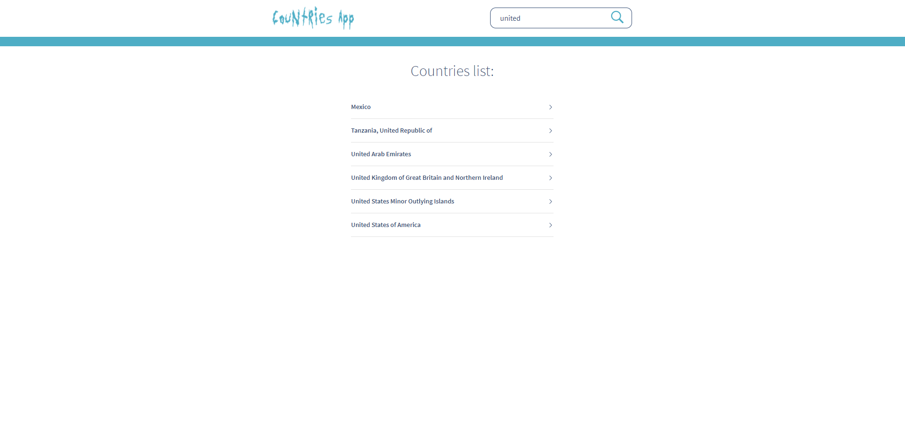
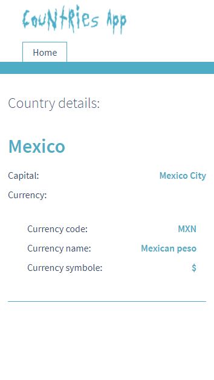

# Countries app

---

**Demo on Netlify:** [LINK](https://piotr-rynio-countries-app.netlify.app)

## Overview

**Countries App** is a web application created in React framework. User can use searcher to find any country in the
world to get to know with basic information about it (**country name, capital, currency data**). Countries data are being
downloaded from [external API](https://restcountries.eu/). **Application gets from API only those data which it actually
needs**. The application uses **memoization of API requests** - it does not send requests for data which it downloaded
already. I did it by use of react-query library. **Pagination** is implemented - one page contains only 20 countries; if
number of countries would equal over 20 then next pages would appear. Application is **fully responsive** - looks well on
both mobile and desktop displays. I coded styles using **Mobile First** principle. **Which country would you like to know
about?**

**API URL:** [https://restcountries.eu/](https://restcountries.eu/)

###### The following technologies/libraries/methodologies were used:

- React
- react-route
- react-query
- react hooks (useState, useLocation, useHistory, useParams)
- Prettier
- Husky (pre-commit)
- lint-staged
- other react libraries (for example: react-query, query-string, react-paginate, react-icons, dart-sass, classnames)
- SCSS
- CSS Modules (with SCSS)
- BEM methodology
- Mobile First & and full responsive
- Clean Code
- the newest features of ECMAScript
- Git & GitHub
- IntelliJ

###### Screens:

---

## Running the project

Running this project locally

###### From the repo:

1. Clone this project locally.
2. Run `yarn install` in your bash/command line.
3. Run `yarn start` in your bash/command line.
4. Go to `http://localhost:3000/` in your browser (or other from your bash/command line info).

Others:

1. Compiles and minifies for production `yarn build`

---

### Authors

**Piotr Rynio**  
Contact:
pwrynio@gmail.com  
github.com/PiotrRynio/
